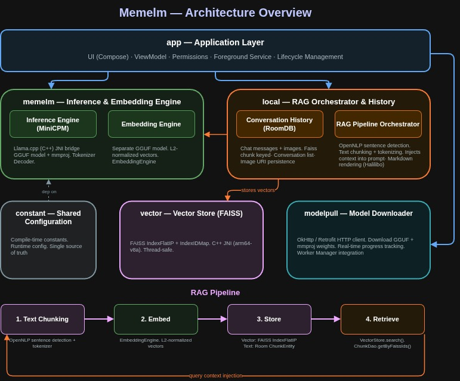

# Memelm

**Memelm** is an Android application that runs the [MiniCPM](https://github.com/OpenBMB/MiniCPM) multimodal language model fully on-device. It leverages [llama.cpp](https://github.com/ggml-org/llama.cpp) under the hood via a JNI bridge, downloads model weights on demand, and wires everything together into a single integrated app.

---

## Architecture Overview

The modules are intentionally separated by responsibility. `constant` feeds into both `memelm` and `modelpull`. The `app` module sits at the top of the dependency graph and assembles everything. The app also runs a full on-device RAG pipeline. This way every message is preprocessed into chunks, converted into vectors, and stored in a local vector store for later retrieval. When you ask a question, relevant past context is pulled from the vector store and injected into the prompt, all without ever leaving your device.

<p align="center">
    
</p>

---

## Latest Preview

Per-Friday/5/June/2026.


https://github.com/user-attachments/assets/404851f5-e82d-4002-80ca-7197976c7f01


---

## Modules

### `memelm` — On-Device Inference & Embedding Engine

Two engines in one module: the main inference runtime for MiniCPM and a separate embedding engine for RAG vector generation.

**Responsibilities:**
- Bridges into [llama.cpp](https://github.com/ggerganov/llama.cpp) via the **Java Native Interface (JNI)**, exposing a Kotlin/Java API over the native C++ inference engine.
- Loads the main GGUF model file and the associated **mmproj** (multimodal projector) file for vision-language tasks.
- Manages the llama.cpp context lifecycle. Including initialization, sampling, token generation, and teardown.
- Handles tokenization and decoding for both text and image inputs.
- Exposes a clean, suspendable API so inference can be called from coroutines without blocking the main thread.
- Provides an **EmbeddingEngine** that loads a separate embedding GGUF model and converts text chunks into L2-normalized float vectors for FAISS.

**Key internals:**

| Layer | Technology |
|---|---|
| Inference runtime | llama.cpp (C++) |
| Embedding runtime | llama.cpp (EmbeddingGemma 300m) |
| Android integration | JNI (`System.loadLibrary`) |
| Native build | CMake / Android NDK |
| API surface | Kotlin (suspend functions / Flow, `EmbeddingEngine.embed()`) |

> **Note:** 
> - The native `.so` libraries are compiled for ABI `arm64-v8a` only and bundled inside this module's AAR.
> - Sample specification from official llama.cpp at `LIB_REF_INFORMATION.md`

---

### `vector` — Vector Store Engine (FAISS)

Native vector store built on FAISS for similarity search in the RAG pipeline.

**Responsibilities:**
- Bridges into [FAISS](https://github.com/facebookresearch/faiss) via JNI, exposing a Kotlin API over native C++ vector operations.
- Manages an `IndexFlatIP` wrapped in `IndexIDMap` for exact inner-product (cosine) search with 64-bit IDs.
- Supports add, search, remove, save, and load — all thread-safe behind a `std::mutex`.
- Persists the index to disk via FAISS native `write_index` / `read_index` binary format.
- Auto-creates the index on first insert (dimension detected from vector length).

**Key internals:**

| Layer | Technology |
|---|---|
| Vector search | FAISS (`IndexFlatIP` + `IndexIDMap`) |
| Android integration | JNI (`System.loadLibrary`) |
| Native build | CMake / Android NDK (`add_subdirectory` of the `faiss/` submodule) |
| API surface | `VectorStore` Kotlin singleton (`init`, `add`, `search`, `remove`, `save`, `release`) |

> **Note:**
> - FAISS is compiled from source via `add_subdirectory` (same pattern as `llama.cpp` in `:memelm`).
> - Disabled: GPU, Python, C API, MKL, SIMD extras — only the flat index code path is built.

---

### `modelpull` — Model Downloader

This module handles everything related to fetching model files from a remote source before the inference engine can run.

**Responsibilities:**
- Downloads the **GGUF model weights** file (the main language model).
- Downloads the **mmproj** (multimodal projector) weights file required for image understanding.
- Reports **real-time download progress** so the UI can display a progress bar or percentage.
- Persists downloaded files to the app's internal storage in a predictable, versioned path.

**Key internals:**

| Concern | Technology                                     |
|---|------------------------------------------------|
| HTTP client | [OkHttp](https://square.github.io/okhttp/)     |
| REST abstraction | [Retrofit](https://square.github.io/retrofit/) |
| Progress tracking | Response `Retrofit` to `Worker Manager`        |

---

### `local` — Conversation Local History & RAG Orchestrator

RoomDB persistence for chat history and the RAG pipeline orchestrator that bridges text chunks with the vector store.
`ChunkEntity` stores text fragments keyed by `faissId` — the shared link between Room text and FAISS vectors.

**Responsibilities:**
- Main place to save conversation history across app.
- Preprocesses messages (OpenNLP sentence detection + tokenization) and splits them into embeddable chunks.
- Orchestrates the RAG pipeline: chunk → embed via `EmbeddingEngine` → store vector in `VectorStore` + text in `ChunkEntity`.
- Retrieves relevant chunks by querying `VectorStore.search()` → `ChunkDao.getChunksByFaissIds()` for context injection.
- Have **conversation list** so the user can just select conversation they want.
- Ability to save image locally and save the path as copy Uri.
- The sentence save as given llm style which markdown, so the display use markdown style renderer 

**Key internals:**

| Concern | Technology                                     |
|---|------------------------------------------------|
| RoomDB | [Room](https://developer.android.com/jetpack/androidx/releases/room)     |
| Text preprocessing | OpenNLP (`sentence detector` + `tokenizer`) |
| Chunk storage | `ChunkEntity` (Room, indexed `faissId`) |
| Markdown | [Halilibo](https://halilibo.com/compose-richtext/) |

---

### `constant` — Shared Configuration

A configuration-only module that acts as the single source of truth for all compile-time and runtime constants shared across the other modules.

**Design principle:** This module depends on nothing and is depended on by everything. Keeping constants here prevents duplication and makes global changes a one-file edit.

---

### `app` — Application 

The top-level Android application module that wires all other modules together into the final installable APK.

**Responsibilities:**
- Integrate all modules based on their specific functionality.
- Composes the UI layer and manage state given by ViewModel.
- Listen to User specific event like cancellation or network error.
- Manages Android permissions, foreground service for long-running downloads, and lifecycle-aware cleanup of native resources.

---

## Important Notes!

### Prerequisites

- Android Studio Hedgehog or later
- Android NDK 27.2.12479018
- CMake 3.31.6

make sure to pull the llama.cpp submodule:
```bash
git submodule update --init --recursive
&&
sudo apt update && sudo apt install ninja-build
```

Don't forget to set the `ANDROID_NDK` environment variable to your NDK path
```bash

NDK_PATH=/home/dani/Android/Sdk/ndk/27.2.12479018

```

> **Vulkan is disabled by default.** Enabling GPU acceleration (Vulkan) requires significant work beyond flipping a flag — Mali-G57 and similar GPUs crash in `ggml_backend_alloc_ctx_tensors_from_buft` due to q6_K tensor incompatibility with `Vulkan_Host` buffers, and Android blocks SIGSEGV handlers (API 27+) making graceful fallback impossible. The engine runs on CPU with KleidiAI NEON kernels and OpenMP threading.

If you find following error about Vulkan SDK missing
```
cp vulkan.hpp \
  "$ANDROID_NDK/toolchains/llvm/prebuilt/linux-x86_64/sysroot/usr/include/vulkan/"

#OR
  
cd /tmp
wget https://github.com/KhronosGroup/Vulkan-Headers/archive/refs/tags/v1.3.275.tar.gz
tar xf v1.3.275.tar.gz

VULKAN_DIR="$NDK_PATH/toolchains/llvm/prebuilt/linux-x86_64/sysroot/usr/include/vulkan"

# Copy everything from the Vulkan-Headers include/vulkan folder
cp -r Vulkan-Headers-1.3.275/include/vulkan/* "$VULKAN_DIR/"
```
Or if you find another error about SPIR-V header missing temporarily 
```bash
cd /tmp
git clone --depth 1 https://github.com/KhronosGroup/SPIRV-Headers.git

NDK_PATH=/home/dani/Android/Sdk/ndk/27.2.12479018
cp -r SPIRV-Headers/include/spirv \
   "$NDK_PATH/toolchains/llvm/prebuilt/linux-x86_64/sysroot/usr/include/"
```

### Required: Firebase Remote Config & google-services.json

This app uses **Firebase Remote Config** to serve model download URLs and API keys at runtime.

1. Create a Firebase project at https://console.firebase.google.com
2. Register your Android app with package name `fun.walawe.memechat` and download `google-services.json`
3. Place it at `app/google-services.json`
4. Go to **Remote Config** in the Firebase Console and add these parameters:

| Key | Purpose | Example Value                                                                                                                                                                                                                                       |
|---|---|-----------------------------------------------------------------------------------------------------------------------------------------------------------------------------------------------------------------------------------------------------|
| `filename_model_llm` | LLM model relative path | `https://huggingface.co/ggml-org/MiniCPM-V-4.6-GGUF/resolve/main/MiniCPM-V-4.6-Q4_K_M.gguf`                                                                                                                                                         |
| `filename_model_mmproj` | MMProj relative path | `https://huggingface.co/ggml-org/MiniCPM-V-4.6-GGUF/resolve/main/mmproj-MiniCPM-V-4.6-Q8_0.gguf`                                                                                                                                                    |
| `filename_model_embedding` | Embedding model relative path | `https://huggingface.co/unsloth/embeddinggemma-300m-GGUF/resolve/main/embeddinggemma-300m-Q4_0.gguf`                                                                                                                                                |
| `huggingface_api_key` | HuggingFace read token (optional) | `hf_...`                                                                                                                                                                                                                                            |
| `mcp_keenable_api_key` | Keenable web search API key (optional) | `keen_...`                                                                                                                                                                                                                                          |

### Required: secrets.properties

Copy and edit `secrets.properties.example` from the project root into `secrets.properties`. Put your default values there:

```properties
FILENAME_MINICPM_V2_Q4_KM=http://192.168.0.103:8081/minicpm/MiniCPM-V-4.6-Q4_K_M.gguf
FILENAME_MINICPM_MMPROJ=http://192.168.0.103:8081/minicpm/mmproj-MiniCPM-V-4.6-Q8_0.gguf
FILENAME_EMBEDDINGGEMMA=http://192.168.0.103:8081/embeddinggemma-300m-Q4_0.gguf
HUGGINGFACE_API_KEY=hf_...
MCP_KEENABLE_API_KEY=keen_...
DEFAULT_SYSTEM_PROMPT=You're a friendly meme decoder...
```

> **secrets.properties** is gitignored and will not be committed.  
> **Priority order**: Firebase Remote Config > `secrets.properties` (local) > environment variables (CI/CD).

---

## License

Distributed under the MIT License. See `LICENSE` for details.

llama.cpp is licensed under the MIT License. MiniCPM model weights are subject to their respective upstream license.
